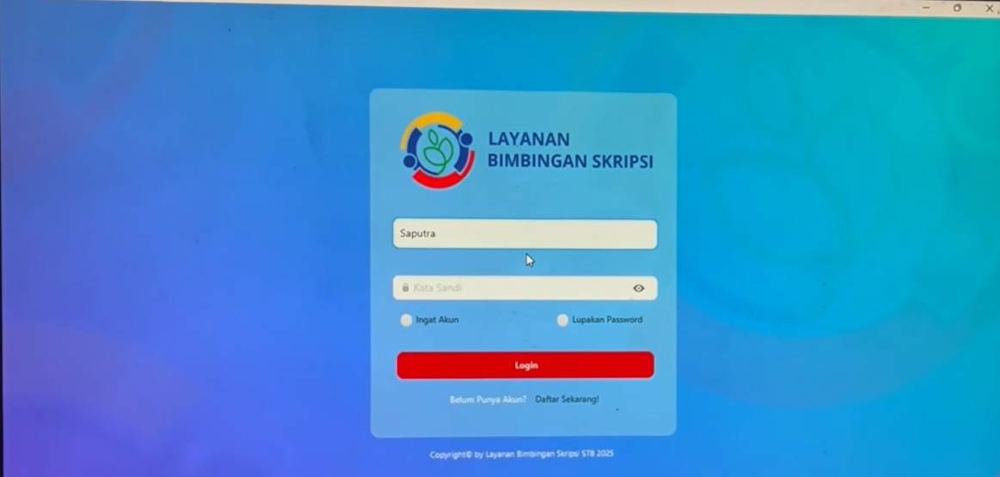
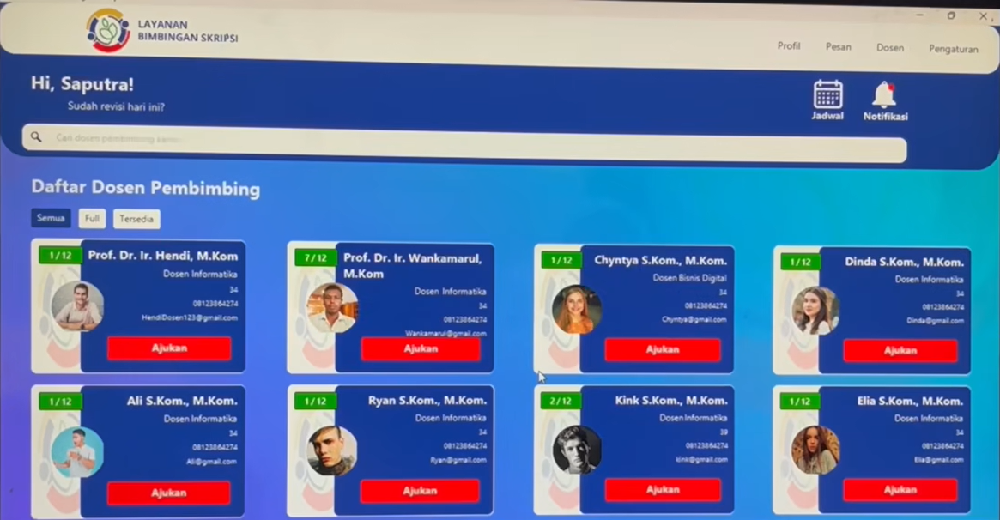
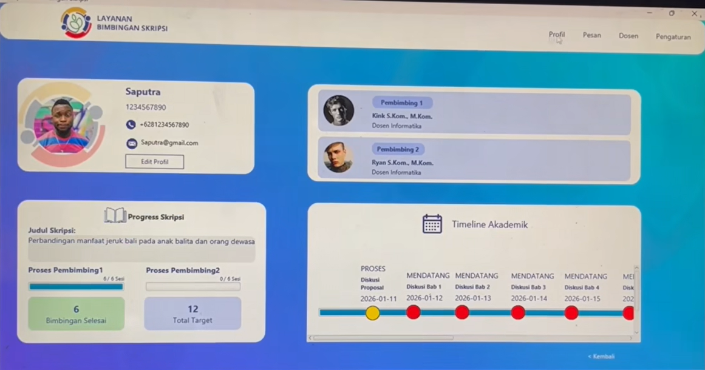
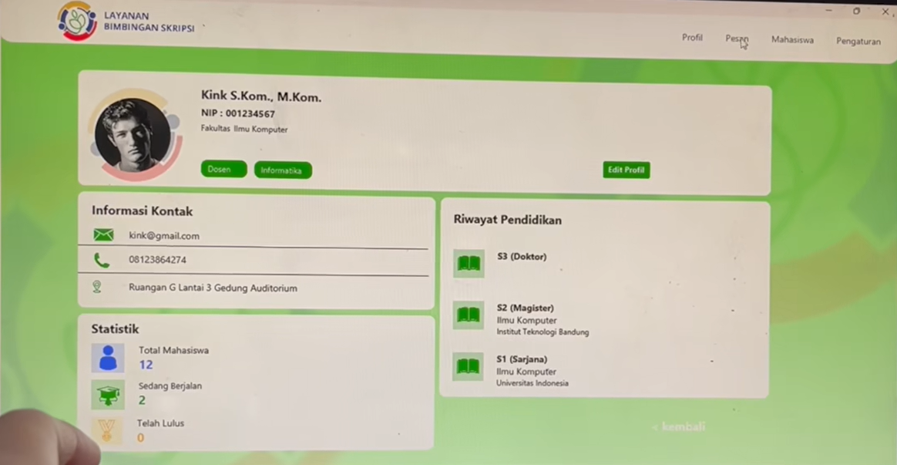
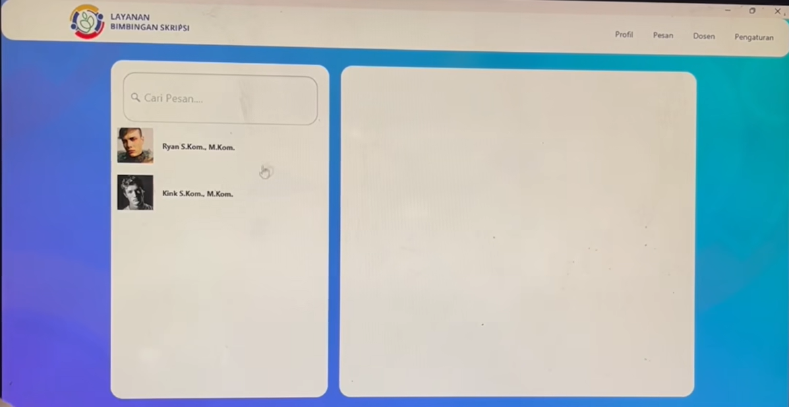
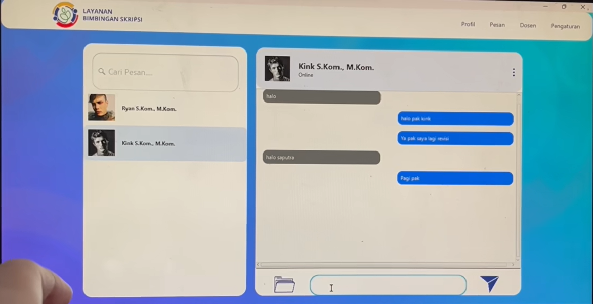
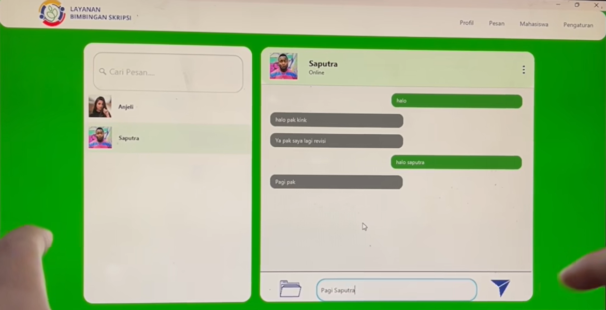
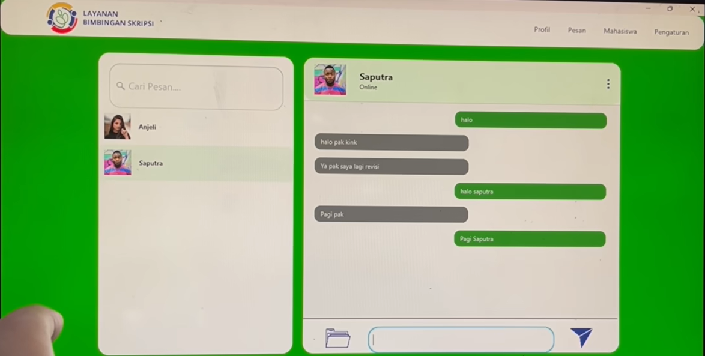
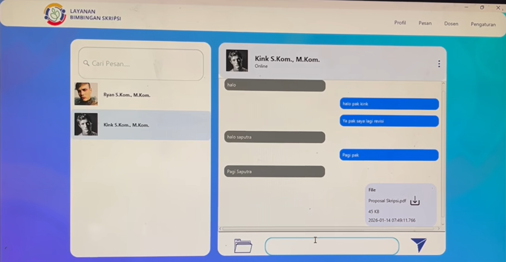
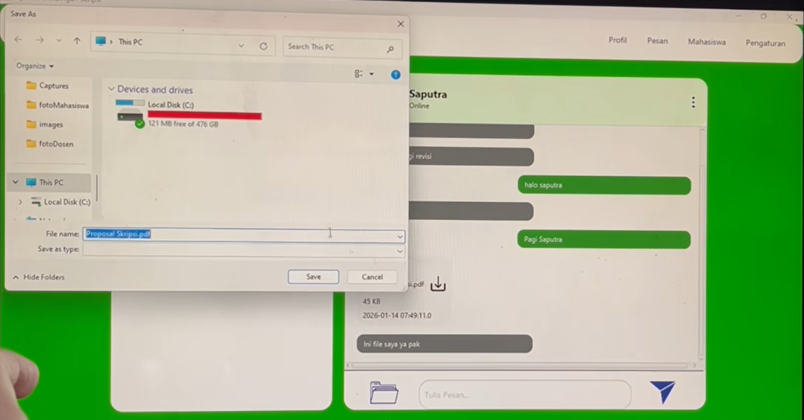

# 🎓 Thesis Supervision System (Java Client–Server)

A Java-based client–server application designed to improve thesis supervision through real-time communication and file sharing between students and supervisors.

## 🚀 Features

* 💬 Real-time chat using Socket Programming
* 📁 File transfer for document exchange
* 👥 User management (Students & Supervisors)
* 🗄️ Database integration for storing messages and supervision data
* 📊 Structured supervision monitoring system

## 🛠️ Tech Stack

* Java
* Socket Programming
* Client–Server Architecture
* Database (MySQL / SQLite - adjust accordingly)

## 🧠 System Architecture

This application follows a client–server model:

* **Client**:

  * User interface
  * Sends requests (chat, file upload/download)

* **Server**:

  * Handles multiple client connections
  * Manages communication
  * Stores data to database

## 🔄 Communication Flow

1. Client connects to server via socket
2. Server authenticates user
3. Real-time communication established
4. Messages & files transmitted
5. Data stored in database

## 📸 Preview
### Login

### Home (Undergraduate Student)

### Profile (Undergraduate Student)

### Profile (Lecturer)

### Chat (Undergraduate Student)

### Chatroom (Undergraduate Student)

### Chatroom1 (Lecturer)

### Chatroom2 (Lecturer)

### Sending File (Undergraduate Student)

### Sending File (Lecturer)

## 📈 Future Improvements

* GUI enhancement (JavaFX / Swing improvement)
* End-to-end encryption for chat
* Cloud deployment
* Notification system

## 👩‍💻 Author

Made with ❤️ by nadaqqn

---

## 🤝 Let's Connect!

I'm always open to discussions, collaborations, or feedback 🚀

💌 Linktr.ee: https://linktr.ee/qonitaqq
